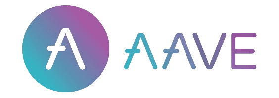

# Hardhat DeFi



1. Deposit collateral: ETH / WETH ✅
2. Borrow another asset: DAI ✅
3. Repay the DAI ✅

_This repo has been revamped to work with Goerli. Due to AaveV2 not being deployed on Goerli, it may not work as intended. Please use a mainnet-fork or local network instead of a testnet._

# Getting Started

## Requirements

-   [git](https://git-scm.com/book/en/v2/Getting-Started-Installing-Git)
    -   You'll know you did it right if you can run `git --version` and you see a response like `git version x.x.x`
-   [Nodejs](https://nodejs.org/en/)
    -   You'll know you've installed nodejs right if you can run:
        -   `node --version` and get an ouput like: `vx.x.x`
-   [Yarn](https://classic.yarnpkg.com/lang/en/docs/install/) instead of `npm`
    -   You'll know you've installed yarn right if you can run:
        -   `yarn --version` and get an output like:`x.x.x`
        -   You might need to install it with npm

## Quickstart

```
git clone https://github.com/Solidityarchitect/hardhat-aave
cd hardhat-aave
yarn
```

# Usage

This repo requires a mainnet rpc provider, but don't worry! You won't need to spend any real money. We are going to be `forking` mainnet, and pretend as if we are interacting with mainnet contracts.

All you'll need, is to set a `MAINNET_RPC_URL` environment variable in a `.env` file that you create. You can get setup with one for free from [Alchemy](https://alchemy.com/?a=673c802981)

Run:

```
yarn hardhat run scripts/aaveBorrow.js
```

## Testing

We didn't write any tests for this, sorry!
